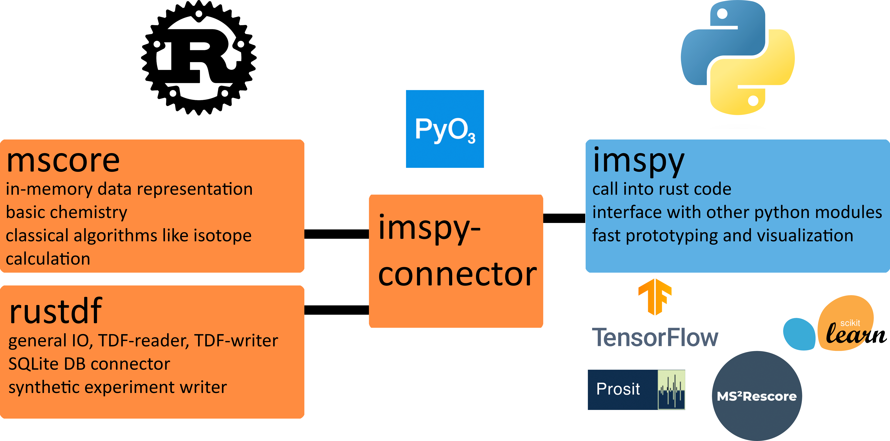

# rustims

<p align="center">
  
</p>

`rustims` is a framework developed for processing raw data from Ion-Mobility Spectrometry (IMS) in [prote]omics mass spectrometry. This project emerged from my Ph.D. research and reflects our involvement in [MSCORESYS](https://www.mscoresys.de/), especially within the [DIASYM](https://diasym.mscoresys.de/) segment. RustIMS draws inspiration from OpenMS but is distinguished by its use of [Rust](https://www.rust-lang.org/) as the backend language, aiming for efficient algorithm implementations and robust data structures. Like OpenMS, rustims exposes most of its logic to Python via [pyO3](https://docs.rs/pyo3/latest/pyo3/). This setup is intended to enable quick prototyping and integration into existing scientific workflows.

# Overview
If you're diving into the realm of ion-mobility mass spectrometry raw data, rustims might offer valuable insights and tools. It could be a fitting project if you:

* Have an interest in the **processing of raw IMS data**.
* Are curious about the **algorithms** behind IMS data processing.
* Have a basic understanding of **programming** concepts.
* Don't mind engaging with a **project that's still evolving**, where bugs and updates are part of the journey (the free-and-open-source way of things).

Conversely, rustims might *not* meet your expectations if you:
* Anticipate a complete, out-of-the-box framework, possibly with a graphical interface.
* Lack any programming experience.
* Are looking for tools focused on downstream analysis or data interpretation for specific research questions.

rustims is about exploring and improving the way we process ion-mobility spectrometry data. It's a work in progress, reflecting the open-source ethos of collaboration, engagement, and sharing of knowledge. Whether you're here to contribute or learn, we welcome your interest!

# Repository Structure


<div align="center">
  
  <p>The rustims project structure. mscore and rustdf are Rust crates that contain in-memory data structures, algorithms and I/O for TDF files. They can be exposed to python via pyO3, exposing their main functionality by compiling them into one installable wheel: imspy_connector. imspy is then a native python package calling into rust but also comming with its own logic, e.g., tensorflow models for ion-mobility prediction.</p>
</div>

## Backend (Rust)
There are two rust projects: `mscore` and `rustdf`. The former is a library that contains implementations of in-memory data structures and algorithms for raw-data processing. The latter contains a Rust-native reader and writer of TDF, the serialization format written by [bruker timsTOF](https://www.bruker.com/en/products-and-solutions/mass-spectrometry/timstof.html) devices. It also contains the implementation of the I/O logic needed for synthetic timsTOF PASEF-like in-silico dataset generation.

## Python bindings & Python library


## Julia bindings

The repository contains a Python (imspy) and a Julia (IMSJL) library that share a rust backend (mscore and rustdf).
The backend is accesible for Python and Julia code by the respective connectors imspy_connector and imsjl_connector, using [PyO3](https://docs.rs/pyo3/latest/pyo3/) or directly via the [FFI](https://doc.rust-lang.org/nomicon/ffi.html).

# Installation

## Install via pip
For ease of use, we now providing up-to-date versions of the python-bound components via Python wheels on PyPi. We recommend that you use a [Python virtual environment](https://docs.python.org/3/library/venv.html) with `python3.11`, since imspy has some heavy weight dependencies like `tensorflow`, `numpy`, and `numba`, where version missmatches can cause you a lot of head scrathing.
```shell
pip install imspy
```

## Build from source

## Backend

## Python bindings
Assuming a [rust](https://www.rust-lang.org/learn/get-started) and Python (>=3.10) version is installed on your system, the
build process currently looks like this:

1.  The Python connector `imspy_connector` needs to be built by [Maturin](https://github.com/PyO3/maturin).
    Maturin can be installed via pip:
    ```shell
    pip install maturin[patchelf]
    ```
    The Python library is installed via [Poetry](https://github.com/python-poetry/poetry).
    Poetry can be installed via pip, as well:
    ```shell
    pip install poetry
    ```
2.  Once Maturin is installed navigate to the `imspy_connector` folder and run:
    ```shell
    maturin build --release
    ```
    This generates a `.whl` file that can be installed by pip.
3.  Install the generated `.whl` file:
    ```shell
    pip install --force-reinstall ./target/wheels/[FILE_NAME].whl
    ```
    The `--force-reinstall` flag ensures that pip is overwriting old installations of the bindings. This
    is relevant when you make changes in the rust backend code (i.e. the bindings themselves, `mscore` or `rustdf`). 
4.  Navigate to the `imspy` folder and install it with Poetry.
    ```shell
    poetry install
    ```
    
## Julia bindings
