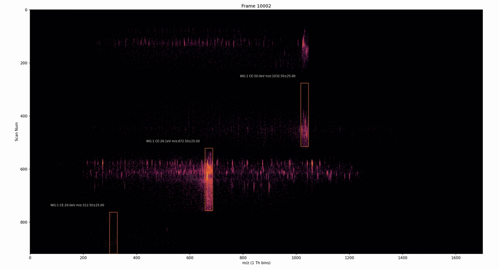
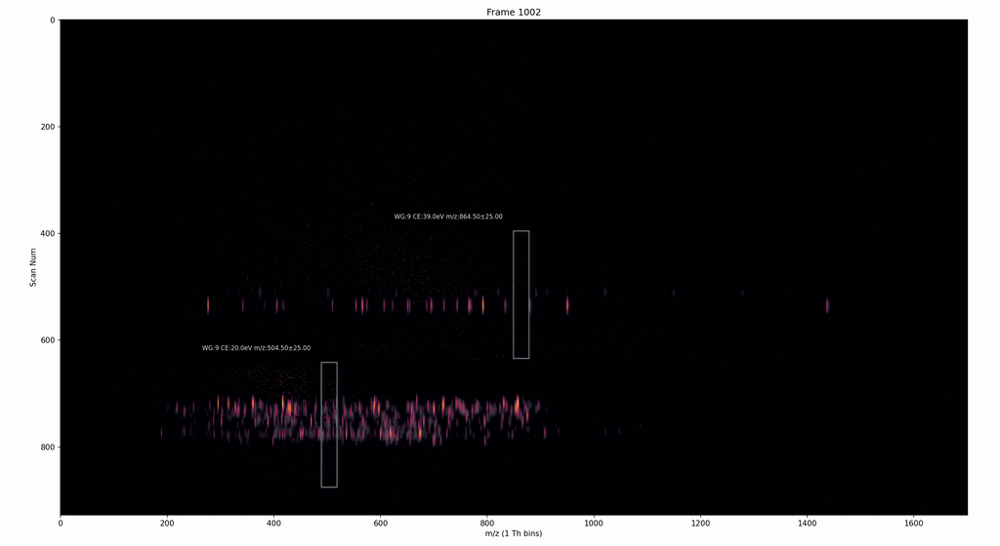

# rustims

<p align="center">
  
</p>

<p align="center">
  <a href="https://pypi.org/project/imspy/"></a>
  <a href="https://pypi.org/project/imspy/"></a>
  <a href="https://github.com/theGreatHerrLebert/rustims/blob/main/LICENSE"></a>
  <a href="https://thegreatherrlebert.github.io/rustims/main/imspy/"></a>
  <a href="https://pubs.acs.org/doi/full/10.1021/acs.jproteome.4c00966"></a>
</p>

<p align="center">
  <strong>High-performance framework for Ion-Mobility Spectrometry data processing</strong>
</p>

---

**rustims** is an open-source framework for processing raw data from Ion-Mobility Spectrometry (IMS) in proteomics mass spectrometry. Built with [Rust](https://www.rust-lang.org/) for performance and exposed to [Python](https://www.python.org/) via [PyO3](https://pyo3.rs/), it combines the speed of compiled code with the flexibility of Python workflows.

## Highlights

- **DDA & DIA Support** — Full pipelines for both Data-Dependent and Data-Independent Acquisition
- **TimSim** — Generate synthetic PASEF-like datasets for method development and benchmarking
- **Deep Learning Integration** — CCS and retention time prediction models
- **Rust Performance** — Core algorithms implemented in Rust for maximum throughput
- **Python API** — Easy integration with existing scientific Python workflows

## Quick Start

```bash
# Install imspy (Python 3.11 required)
pip install imspy

# Optional: GPU support for deep learning
pip install tensorflow[and-cuda]==2.15.*
```

### Analyze DDA Data

```bash
# Run the DDA analysis pipeline
imspy_dda path/to/data.d path/to/proteome.fasta

# See all options
imspy_dda --help
```

### Work with timsTOF Data in Python

```python
from imspy.timstof import TimsDatasetDDA

# Load a dataset
ds = TimsDatasetDDA("path/to/data.d")

# Access frames
frame = ds.get_frame(1)
print(f"Frame 1: {len(frame.mz)} peaks")

# Get spectra for a precursor
spectra = ds.get_pasef_fragments(precursor_id=42)
```

## Features

### DIA Feature Extraction

The DIA module provides hierarchical feature extraction with adaptive thresholding:

```python
from imspy.timstof.dia import TimsDatasetDIA

# Load DIA dataset
ds = TimsDatasetDIA("path/to/dia_data.d")

# Extract features with adaptive noise thresholds
# Thresholds automatically adjust to local signal characteristics
clusters = ds.extract_features(
    window_group=1,
    adaptive_threshold=True,  # Uses N × local noise instead of fixed threshold
    sigma_multiplier=3.0      # 3× noise floor
)
```

**Adaptive thresholding** eliminates hard-coded global thresholds that fail across:
- Different regions of the LC gradient
- Varying m/z ranges with different noise floors
- Samples with different intensity scales

### TimSim: Synthetic Data Generation

Generate realistic PASEF-like datasets for benchmarking and method development:

```bash
# Command line
timsim output.d reference.d proteome.fasta --config config.toml

# Or use the GUI
timsim_gui
```

<p align="center">
  <em>Real DIA-PASEF (top) vs TimSim synthetic data (bottom)</em>
</p>

<p align="center">
  
  
</p>

### Deep Learning Models

Built-in models for predicting:
- **Collisional Cross Section (CCS)** from peptide sequence
- **Retention Time (RT)** prediction
- **Fragment Ion Intensities** via [Prosit](https://www.proteomicsdb.org/prosit/) (Wilhelm et al.)

```python
from imspy.algorithm.ccs import DeepCCSPredictor

predictor = DeepCCSPredictor()
ccs = predictor.predict("PEPTIDEK", charge=2)
```

## Architecture

<p align="center">
  
</p>

### Rust Layer

| Crate | Description |
|-------|-------------|
| **mscore** | Core data structures (spectra, frames, peptides) and algorithms |
| **rustdf** | TDF file I/O, DIA clustering, peak detection |
| **imspy_connector** | PyO3 bindings exposing Rust to Python |

### Python Layer (Modular)

| Package | Description |
|---------|-------------|
| **imspy-core** | Base data structures, timsTOF dataset access |
| **imspy-predictors** | TensorFlow models for CCS, RT, fragment intensities |
| **imspy-dia** | DIA-PASEF clustering and feature extraction |
| **imspy-search** | Database search integration (sagepy, mokapot) |
| **imspy-simulation** | TimSim synthetic data generation |
| **imspy-gui** | Interactive visualization tools |

The Rust core provides:
- Memory-efficient data structures for large datasets
- Parallel processing with [rayon](https://github.com/rayon-rs/rayon)
- Zero-copy data sharing with Python via NumPy arrays

## Installation

### From PyPI (Recommended)

```bash
# Full installation - includes all modules
pip install imspy

# With GPU support
pip install imspy tensorflow[and-cuda]==2.15.*
```

### Modular Installation

For more control over dependencies, install only the modules you need:

| Package | Description | Install |
|---------|-------------|---------|
| **imspy-core** | Core data structures and timsTOF I/O | `pip install imspy-core` |
| **imspy-predictors** | ML models for CCS, RT, intensity prediction | `pip install imspy-predictors` |
| **imspy-dia** | DIA-PASEF feature extraction and clustering | `pip install imspy-dia` |
| **imspy-search** | Database search via sagepy + rescoring | `pip install imspy-search` |
| **imspy-simulation** | TimSim synthetic data generation | `pip install imspy-simulation` |
| **imspy-gui** | Visualization and plotting tools | `pip install imspy-gui` |

**Dependency tree:**
```
imspy-core          (base - required by all)
├── imspy-predictors   (adds TensorFlow ML models)
│   ├── imspy-search      (adds sagepy database search)
│   └── imspy-simulation  (adds TimSim)
├── imspy-dia          (adds DIA clustering pipeline)
└── imspy-gui          (adds visualization)
```

Example: For DDA analysis with search, install `imspy-search` which pulls in predictors and core automatically:
```bash
pip install imspy-search
```

### From Source

```bash
# Clone repository
git clone https://github.com/theGreatHerrLebert/rustims.git
cd rustims

# Build Rust components
cd mscore && cargo build --release
cd ../rustdf && cargo build --release

# Build Python bindings
pip install maturin[patchelf]
cd ../imspy_connector && maturin build --release
pip install target/wheels/*.whl

# Install Python package
cd ../imspy && pip install poetry && poetry install
```

### Docker

Pre-built images available for reproducible environments:
- [AMD64](https://github.com/MatteoLacki/rustims_docker/raw/refs/heads/main/release.zip)
- [ARM64](https://github.com/MatteoLacki/rustims_docker/raw/refs/heads/main/release_arm64.zip)

## Documentation

- **API Reference**: [imspy](https://thegreatherrlebert.github.io/rustims/main/imspy/) | [mscore](https://thegreatherrlebert.github.io/rustims/main/mscore/) | [rustdf](https://thegreatherrlebert.github.io/rustims/main/rustdf/)
- **Examples**: [Jupyter notebooks](https://github.com/theGreatHerrLebert/rustims/tree/main/imspy/examples)
- **sagepy**: [Database search examples](https://github.com/theGreatHerrLebert/sagepy/tree/main/sagepy/examples)

## Citation

If you use rustims in your research, please cite:

> Teschner, D., Gomez-Zepeda, D., Łącki, M.K., Kemmer, T., Busch, A., Tenzer, S., and Hildebrandt, A. "Rustims: An Open-Source Framework for Rapid Development and Processing of timsTOF Data-Dependent Acquisition Data." *Journal of Proteome Research* 24(5), 2358-2368 (2025). [DOI: 10.1021/acs.jproteome.4c00966](https://pubs.acs.org/doi/full/10.1021/acs.jproteome.4c00966)

```bibtex
@article{teschner2025rustims,
  title={Rustims: An Open-Source Framework for Rapid Development and Processing of timsTOF Data-Dependent Acquisition Data},
  author={Teschner, David and Gomez-Zepeda, David and {\L}{\k{a}}cki, Mateusz K. and Kemmer, Thomas and Busch, Anne and Tenzer, Stefan and Hildebrandt, Andreas},
  journal={Journal of Proteome Research},
  volume={24},
  number={5},
  pages={2358--2368},
  year={2025},
  publisher={American Chemical Society},
  doi={10.1021/acs.jproteome.4c00966}
}
```

## Contributing

Contributions are welcome! Whether it's bug reports, feature requests, or code contributions:

1. **Issues**: [Open an issue](https://github.com/theGreatHerrLebert/rustims/issues) for bugs or feature requests
2. **Pull Requests**: Fork the repo, create a branch, and submit a PR
3. **Discussions**: Join the conversation in [GitHub Discussions](https://github.com/theGreatHerrLebert/rustims/discussions)

## License

MIT License - see [LICENSE](LICENSE) for details.

---

<p align="center">
  <sub>Built with Rust and Python | Maintained by the rustims team</sub>
</p>
